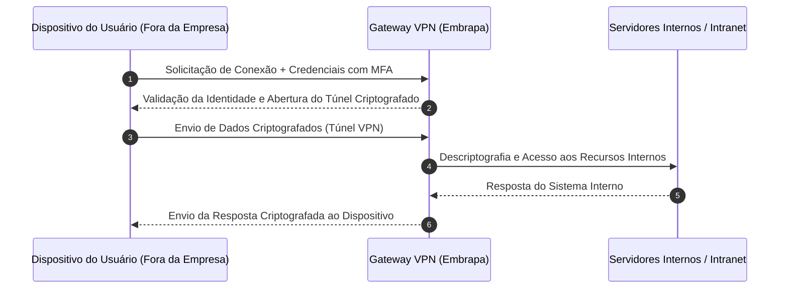

tipo: conceito  
serviço: VPN Corporativa  
público: usuario-final  
criticidade: media  
plataforma: Windows / Linux / macOS / Android / iOS  
versão: N/A  
autor-responsavel: Suporte Técnico & Redes  
revisao: 2026-07  
palavras-chave:  
- vpn  
- acesso remoto  
- tunel criptografado  
- seguranca da informacao  
- conectividade corporativa  

# O que é VPN?

## Objetivo

Apresentar o conceito de VPN (*Virtual Private Network*), seu funcionamento geral, casos de uso no ambiente corporativo da Embrapa e os benefícios de sua utilização para acesso remoto seguro aos sistemas e recursos institucionais. Este artigo destina-se a colaboradores (usuários finais), equipes de suporte e administradores de TI.

## Definição

Uma **VPN** (*Virtual Private Network* - Rede Privada Virtual) é uma tecnologia de segurança de rede que estabelece uma conexão direta, privada e criptografada entre o dispositivo do usuário (notebook, computador ou smartphone) e a rede corporativa da Embrapa, utilizando a infraestrutura pública da Internet.

No ambiente de TI da Embrapa, a VPN atua como uma ponte de comunicação segura, permitindo que colaboradores em trabalho remoto (*home office*), em viagens de trabalho ou em atividades de campo acessem sistemas internos, pastas de arquivos da rede e ferramentas de gestão com o mesmo nível de segurança como se estivessem fisicamente conectados à rede local de uma unidade.

## Como funciona

A VPN funciona criando um "túnel" virtual protegido entre o dispositivo do usuário e o gateway de segurança da Embrapa:

1. **Autenticação de Usuário**: O usuário abre o aplicativo cliente de VPN em seu dispositivo, informa suas credenciais corporativas e realiza a confirmação de identidade via Autenticação de Múltiplos Fatores (MFA).
2. **Criação do Túnel Criptografado**: Após a validação das credenciais, o software estabelece um canal de comunicação codificado através de protocolos seguros de criptografia.
3. **Criptografia dos Dados**: Todos os dados transmitidos pelo dispositivo com destino aos sistemas internos da Embrapa são automaticamente codificados antes de saírem para a Internet.
4. **Descriptografia e Roteamento**: Ao chegarem ao gateway de VPN na rede da Embrapa, os dados são decodificados e direcionados com segurança ao servidor de destino (ex: sistema de arquivos, banco de dados ou intranet).

### Fluxo de Comunicação VPN

## Quando usar

A utilização da VPN Corporativa é recomendada nos seguintes cenários:

- **Trabalho Remoto (Teletrabalho / Home Office)**: Para acessar sistemas restritos à rede interna da Embrapa a partir da residência do colaborador.
- **Trabalho de Campo e Viagens Institucionais**: Durante eventos, viagens ou pesquisas de campo onde seja necessário conectar-se a recursos corporativos.
- **Conexão em Redes Não Confiáveis**: Ao utilizar redes Wi-Fi públicas (aeroportos, hotéis, eventos), garantindo que os dados corporativos e senhas não sejam interceptados.
- **Acesso a Pastas de Rede e Servidores Internos**: Quando o colaborador precisa acessar arquivos compartilhados em drives corporativos ou sistemas administrativos não expostos na Internet aberta.

## Vantagens

- **[Segurança e Criptografia de Dados]**: Protege dados sensíveis e credenciais de acesso contra interceptações por terceiros em redes públicas ou desprotegidas.
- **[Acesso Transparente a Recursos Internos]**: Permite utilizar sistemas internos, pastas de rede e ferramentas corporativas de forma idêntica ao acesso presencial.
- **[Integridade da Informação]**: Garante que os dados trafegados não sejam alterados ou modificados durante o trajeto pela Internet.
- **[Controle de Acesso Centralizado]**: Integração com a autenticação corporativa e segundo fator de autenticação (MFA), garantindo compliance com as políticas de segurança da informação (PSI).

## Limitações

- **Dependência da Conexão com a Internet**: O desempenho, velocidade e estabilidade do acesso dependem diretamente da qualidade da Internet contratada pelo usuário.
- **Ligeiro Aumento na Latência**: O processo de criptografar e descriptografar dados pode introduzir um pequeno tempo de resposta adicional em relação ao acesso direto local.
- **Necessidade de Software Cliente**: Exige a prévia instalação, configuração e manutenção do aplicativo cliente VPN homologado nos dispositivos.
- **Capacidade do Gateway**: O número de acessos simultâneos é limitado pela capacidade computacional e de banda dos gateways corporativos da Embrapa.

## Veja também

- [Como instalar e configurar a VPN Corporativa no Windows e Linux](file:///home/andre/GitHub/kcs/tutorial_instalar_vpn.md)
- [Guia de Autenticação em Duas Etapas (MFA) para Acesso Remoto](file:///home/andre/GitHub/kcs/procedimento_mfa_vpn.md)
- [Incidentes Recorrentes: Erro de Falha de Conexão na VPN](file:///home/andre/GitHub/kcs/incidente_falha_autenticacao_vpn.md)

## Referências

- Documentação Oficial da Política de Segurança da Informação (PSI) da Embrapa.
- Documentação Técnica do Gateway de Segurança e VPN Corporativa.
- [NIST SP 800-113 - Guide to SSL VPNs](https://csrc.nist.gov/)
