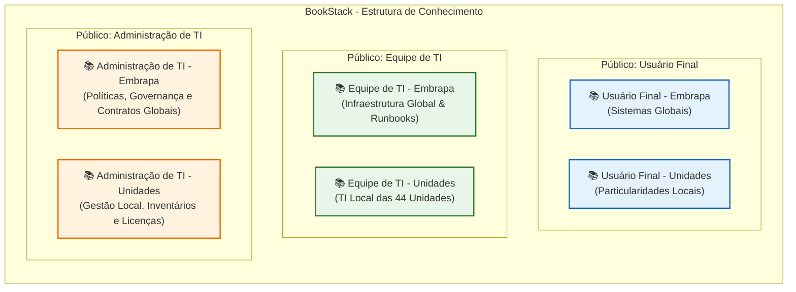

# Estrutura KCS e BookStack: Corporativo & Unidades Descentralizadas

Este documento consolida a arquitetura de informação e a taxonomia recomendadas para a Base de Conhecimento da Embrapa no BookStack. O desenho foi desenvolvido com foco na metodologia KCS (Knowledge-Centered Service), permitindo a coexistência de conteúdos corporativos globais e particularidades de 44 unidades descentralizadas, facilitando o controle de acessos e a indexação eficiente para sistemas de inteligência artificial (RAG - Retrieval-Augmented Generation).

Este plano evolui a partir dos conceitos preliminares mapeados em [kcs_estrutura_001.md](file:///home/andre/GitHub/kcs/kcs_estrutura_001.md) e [kcs_estrutura_002.md](file:///home/andre/GitHub/kcs/kcs_estrutura_002.md).

---

## 🏗️ Visão Geral da Arquitetura (6 Estantes)

A estrutura organiza-se em 6 Estantes (Shelves) principais no BookStack. Esta divisão segmenta a informação em três públicos-alvo (Usuário Final, Equipe Técnica de TI e Gestores/Administradores de TI) e duas esferas de atuação (Corporativo/Embrapa e Local/Unidades).

---

## 📚 1. Estante: Usuário Final - Embrapa

Esta estante destina-se a **todos os colaboradores** da Embrapa (usuários de negócio) e contém o conhecimento corporativo de autoatendimento sobre serviços e plataformas globais. Os artigos devem ser escritos em linguagem não técnica, direta e estruturados como FAQ ou guias de passo a passo.

> [!TIP]
> Esta estante deve ser indexada prioritariamente pelo Chatbot de Autoatendimento do Usuário no Portal de Serviços (ex: TOPdesk).

### Livros & Capítulos Sugeridos

*   **📖 Livro: Google Workspace (Corporativo)**
    *   `📂 E-mail & Gmail`: Configuração de assinaturas, filtros, regras de encaminhamento.
    *   `📂 Google Drive`: Compartilhamento seguro de arquivos, drives compartilhados, limites.
    *   `📂 Google Agenda & Meet`: Agendamento de salas de reunião virtuais, convites externos.
    *   `📂 Segurança do Workspace`: Autenticação em duas etapas, boas práticas.
*   **📖 Livro: Conectividade & Acesso Remoto**
    *   `📂 VPN Corporativa`: Como instalar o cliente VPN padrão, guias de conexão segura.
    *   `📂 Redes Wi-Fi nas Sedes`: Como conectar na rede Wi-Fi corporativa segura.
*   **📖 Livro: Portal de Serviços (TOPdesk)**
    *   `📂 Abertura de Chamados`: Como registrar requisições e incidentes passo a passo.
    *   `📂 Consulta de Serviços`: Como consultar o catálogo de serviços ativos e prazos de atendimento (SLA).
*   **📖 Livro: Segurança da Informação para Usuários**
    *   `📂 Boas Práticas`: Gerenciamento de senhas corporativas, prevenção a phishing e LGPD no dia a dia.

---

## 📚 2. Estante: Usuário Final - Unidades

Esta estante armazena **artigos específicos de autoatendimento para cada unidade**. Em vez de misturar processos locais na base corporativa, os colaboradores acessam este espaço para descobrir particularidades geográficas ou operacionais da sua unidade.

> [!NOTE]
> Para evitar poluição visual no BookStack, as 44 unidades são organizadas como **Livros individuais** dentro desta única estante.

### Estrutura de Livros (Um por Unidade)

*   **📖 Livro: Embrapa Gado de Corte (Exemplo)**
    *   `📂 Ramais e Contatos Locais`: Lista de ramais de setores da unidade, recepção, e-mails de contato.
    *   `📂 Impressão Local`: Como configurar as impressoras físicas nos blocos da unidade.
    *   `📂 Regras de Convivência & Acesso`: Horários de funcionamento de prédios, normas locais de uso dos computadores, reserva de salas locais.
*   **📖 Livro: Embrapa Tabuleiros Costeiros (Exemplo)**
    *   *(Mesma estrutura padronizada de capítulos acima, adaptada para as informações da localidade)*
*   *... Repete-se para as demais 42 Unidades.*

---

## 📚 3. Estante: Equipe de TI - Embrapa

Esta estante é o repositório central de conhecimento técnico para **toda a equipe de analistas de TI da Embrapa** (Sede e Unidades). O conteúdo engloba runbooks de infraestrutura corporativa, procedimentos de suporte de nível 2 e 3, arquitetura de sistemas corporativos e guias de troubleshooting globais.

### Livros & Capítulos Sugeridos

*   **📖 Livro: Plataforma de ITSM (TOPdesk)**
    *   `📂 Administração`: Gestão de operadores, grupos de atendimento, permissões de acesso.
    *   `📂 Catálogo & Fluxos`: Desenho de fluxos de eventos, parametrização de SLAs, automações.
    *   `📂 APIs & Integrações`: Documentação de Webhooks, chamadas REST API e integração com RAG/IA.
*   **📖 Livro: Administração Google Workspace (TI)**
    *   `📂 Gestão de Licenciamento`: Processo de atribuição de licenças, cotas de armazenamento global.
    *   `📂 Auditoria & Segurança`: Logs do Admin Console, investigação de phishing, e-discovery.
*   **📖 Livro: Infraestrutura Corporativa (DevOps & Nuvem)**
    *   `📂 Docker & Containers`: Padrões de Docker Compose corporativos, persistência de volumes, Docker Swarm.
    *   `📂 PostgreSQL Corporativo`: Estratégia de replicação, backup centralizado (`pg_dump` / `barman`), auditoria.
    *   `📂 Monitoramento (Zabbix/Grafana)`: Configuração de templates globais, alertas integrados ao TOPdesk.
*   **📖 Livro: Redes & Segurança Corporativa**
    *   `📂 Switches e Roteadores`: Políticas de roteamento central, VLANs corporativas, regras de Firewall corporativo.
    *   `📂 VPN Corporativa (Servidores)`: Configuração do gateway VPN global, certificados de segurança.

---

## 📚 4. Estante: Equipe de TI - Unidades

Destinada aos **analistas de TI locais de cada uma das 44 unidades**. Permite que o analista de suporte local documente a infraestrutura técnica específica do seu campus físico, simplificando o onboarding de novos analistas locais e permitindo que o suporte central da Sede apoie a unidade em caso de emergência.

### Estrutura de Livros (Um por Unidade)

*   **📖 Livro: TI - Embrapa Gado de Corte (Exemplo)**
    *   `📂 Infraestrutura de Rede Local`: Topologia física da unidade, rack, identificação de switches locais, senhas locais de gerência.
    *   `📂 Servidores Locais`: Configuração do Active Directory local (Read-Only Domain Controller), servidores de arquivos locais, rotinas de backup locais.
    *   `📂 Telefonia e Links Locais`: Contratos locais de internet link, operadora contratada, contingência.
    *   `📂 Contatos Técnicos Locais`: Fornecedores locais de hardware, assistência técnica local.
*   **📖 Livro: TI - Embrapa Tabuleiros Costeiros (Exemplo)**
    *   *(Configurações específicas desta localidade).*
*   *... Repete-se para as demais 42 Unidades.*

---

## 📚 5. Estante: Administração de TI - Embrapa

Focada em **gestores de TI da Sede, arquitetos e diretores corporativos**. Contém documentação estratégica, diretrizes de segurança da informação organizacionais, portfólios de projetos estratégicos, governança de TI e políticas de compras/aquisições de tecnologia de nível global.

> [!WARNING]
> Os artigos desta estante costumam ter caráter sigiloso ou estratégico. As permissões de acesso devem ser restritas aos gestores e assessores da Secretaria de TI (SIT).

### Livros & Capítulos Sugeridos

*   **📖 Livro: Governança, Políticas & Normas**
    *   `📂 Normativas de TI`: Política de Segurança da Informação (PSI), termos de uso de recursos de TI corporativos.
    *   `📂 Processos KCS & ITIL`: Manual de funcionamento da gestão de incidentes, catálogo de serviços e ciclo de vida do conhecimento na Embrapa.
*   **📖 Livro: Planejamento Estratégico de TI**
    *   `📂 PETI (Planejamento)`: Plano Estratégico de Tecnologia da Informação vigente, metas institucionais de TI.
    *   `📂 PDTIC`: Plano Diretor de Tecnologia da Informação e Comunicação.
*   **📖 Livro: Arquitetura Corporativa de Sistemas**
    *   `📂 Integrações Centrais`: Mapa de fluxo de dados corporativo, barramento de integração de sistemas internos.
    *   `📂 Padrões Tecnológicos`: Linguagens de programação homologadas, bancos de dados aceitos, stack recomendada.

---

## 📚 6. Estante: Administração de TI - Unidades

Espaço dedicado a **gestores, chefes de TI local (COTIs) e administradores de cada unidade**. Concentra documentações administrativas específicas de contratos locais de TI, convênios de tecnologia, inventários e planos de resposta a desastres específicos de cada instalação física.

### Estrutura de Livros (Um por Unidade)

*   **📖 Livro: Gestão TI - Embrapa Gado de Corte (Exemplo)**
    *   `📂 Inventário e Licenciamento Local`: Listagem de ativos de hardware da unidade, computadores alugados ou próprios, licenças específicas da unidade.
    *   `📂 Contratos Locais de TI`: Contratos locais de suporte a impressoras, manutenção predial da sala de servidores da unidade, link local.
    *   `📂 Plano de Continuidade Local`: Plano de evacuação de servidores em caso de sinistro local, contatos da concessionária de energia local, gerador de energia.
*   **📖 Livro: Gestão TI - Embrapa Tabuleiros Costeiros (Exemplo)**
    *   *(Documentação de gestão técnica da localidade).*
*   *... Repete-se para as demais 42 Unidades.*

---

## 💡 Melhores Práticas de KCS Aplicadas a Esta Estrutura

### 1. Artigos Focados em Resoluções Únicas
Cada página de conhecimento deve responder a **apenas uma pergunta ou problema**.
*   **Ruim:** Um livro sobre "Redes" com uma página contendo todos os problemas de conexão, senhas de switches e problemas da VPN.
*   **Bom:** Páginas específicas como *"Não consigo conectar à VPN: Erro de Autenticação"* na estante do usuário final, e *"Configurar autenticação LDAP do VPN Client no Servidor"* na estante da equipe de TI.

### 2. Fluxo de Validação de Conteúdo (KCS State)
Implemente Tags no BookStack para controlar o ciclo de vida do conhecimento:
*   `kcs-state: draft` (Rascunho criado por analista durante um atendimento).
*   `kcs-state: work-in-progress` (Sendo revisado pela equipe local ou central).
*   `kcs-state: validated` (Revisado, confiável e pronto para consumo geral ou IA).
*   `kcs-state: archive` (Conhecimento obsoleto mantido para histórico).

### 3. Gerenciamento de Permissões e Autonomia (44 Unidades)
Para evitar gargalos de aprovação na equipe de TI Central:
*   A equipe da TI local da **Unidade A** tem permissão de **Edição e Criação (KCS Coach / Publisher)** nos livros da **Unidade A** nas estantes `Usuário Final - Unidades`, `Equipe de TI - Unidades` e `Administração de TI - Unidades`.
*   Nas estantes corporativas (`- Embrapa`), os analistas locais criam novos conhecimentos usando o estado `draft` (Rascunho), e a equipe corporativa da Sede atua como **KCS Publisher** para revisar e validar os conteúdos globais.

### 4. Integração Inteligente com Chatbots (RAG)
Ao expor a base de conhecimento para um assistente virtual, use as estantes como filtros lógicos:
1.  **Filtro de Audiência:** Se o usuário é um colaborador final, a IA busca **apenas** nas estantes `Usuário Final - Embrapa` e `Usuário Final - Unidades`.
2.  **Filtro Geográfico:** A IA identifica a unidade do colaborador (ex: *Embrapa Tabuleiros Costeiros*). Ao buscar na estante de Unidades, ela filtra **apenas** o livro correspondente àquela unidade. Se não encontrar uma solução específica local, o chatbot recorre à base corporativa `Usuário Final - Embrapa`.
3.  **Segurança da Informação:** A IA de autoatendimento do cliente deve ser bloqueada de acessar as estantes `Equipe de TI` e `Administração de TI` para evitar vazamento de dados internos de segurança ou runbooks técnicos.
